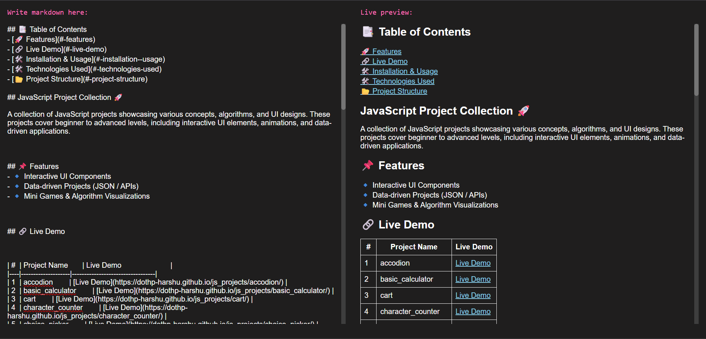
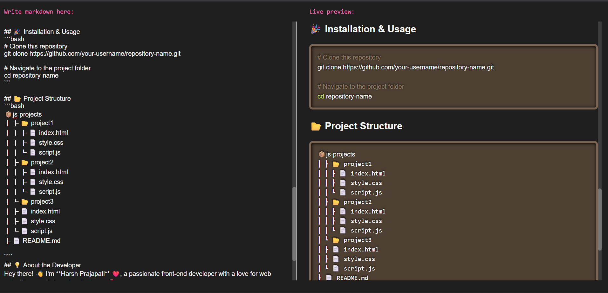

# 📝 React Markdown Editor

A lightweight, real-time Markdown editor built with [React](https://reactjs.org/) and powered by [react-markdown](https://github.com/remarkjs/react-markdown).

## ✨ Features

- Live Markdown preview
- Syntax highlighting
- Supports tables, task lists, code blocks, and more
- Customizable with plugins

