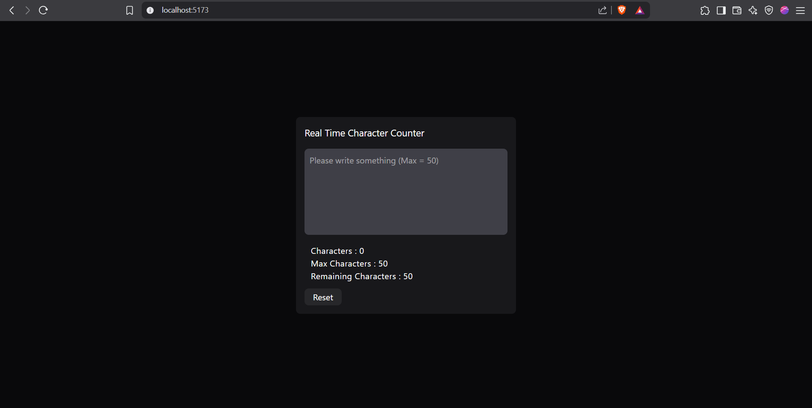
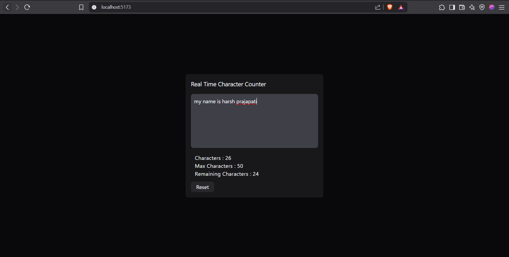
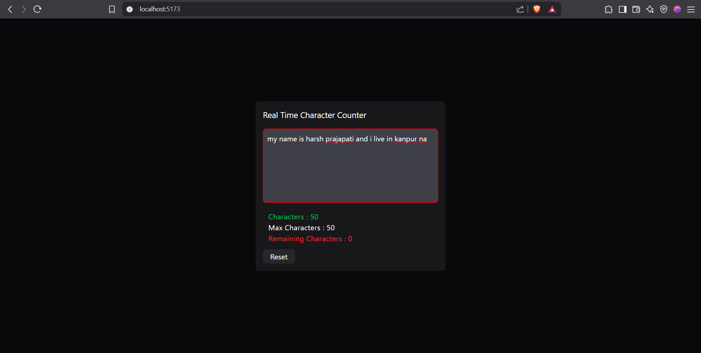

# Real Time Character Counter

This is a real time character counter that

- Counts the `total number of character` typed in textbox.
- Counts the `remaining number of character` from max number of characters in textbox.

# Preview

